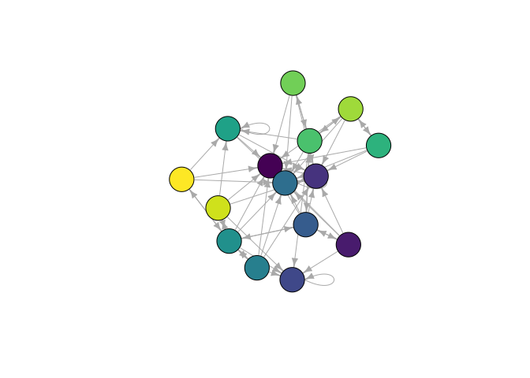
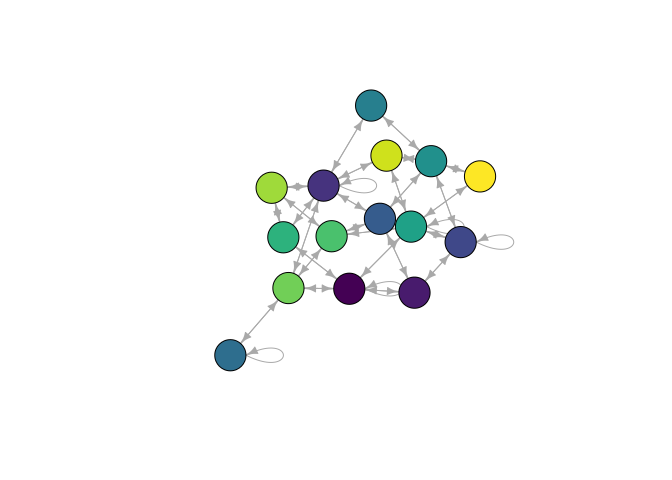

Make Reduced From Partition
================
Steven Wolf
2020-12-09

## Setup for the new function `make_reduced_from_partition`

Load all libraries and load the new function

``` r
library(concorR)
library(igraph)
```

    ## 
    ## Attaching package: 'igraph'

    ## The following objects are masked from 'package:stats':
    ## 
    ##     decompose, spectrum

    ## The following object is masked from 'package:base':
    ## 
    ##     union

``` r
library(viridis)
```

    ## Loading required package: viridisLite

``` r
#source('mrfp.R')
```

This function ~~will be~~ has been added to the `concorR` repository on
my fork ~~in the next few days~~. The Travis status is:

<!-- badges: start -->

[](https://travis-ci.com/sfwolfphys/concorR)
<!-- badges: end -->

## Proof of concept

Note: given the fact that we have an existing network/partition, I
decided to make the input be a single adjacency matrix/partition rather
than a list of adjacency matricies/partitions. We want to have the list
input for the other method because concor uses list inputs. However, it
is superfluous here.

I messed with `edge_betweenness` to find communities in the examples in
the standard README for `concorR`. They were not instructive (only one
community), so I abandoned that. Instead, I have created a random
network and found communities there:

``` r
set.seed(1234)
g  <-  erdos.renyi.game(50,p=0.2)
g_adj  <- as.matrix(as_adjacency_matrix(g))
ebc.g  <- edge.betweenness.community(g)
ebPart  <- ebc.g$membership
```

Show the whole network:

``` r
vColor = viridis(max(unlist(ebPart)))
plot(g, vertex.color = vColor[ebc.g$membership])
```

<!-- -->

First, let’s show that the reduced network works for the degree
statistic:

``` r
g.red  <- make_reduced_from_partition(g_adj, ebPart, stat='degree')
plot_reduced(make_reduced_igraph(g.red$reduced_mat))
```

<!-- -->

And now, the density statistic:

``` r
g.red.den  <- make_reduced_from_partition(g_adj, ebPart, stat='density')
plot_reduced(make_reduced_igraph(g.red.den$reduced_mat))
```

<!-- -->

## Full function text

``` r
make_reduced_from_partition
```

    ## function (adj_mat, partition, stat = "density") 
    ## {
    ##     if (stat == "density") {
    ##         dens <- .edge_dens(adj_mat)
    ##         nb = max(partition)
    ##         reduced_den = matrix(0, nrow = nb, ncol = nb)
    ##         rownames(reduced_den) = paste("Block", 1:nb)
    ##         colnames(reduced_den) = paste("Block", 1:nb)
    ##         for (j in 1:nb) {
    ##             nRows = sum(j == partition)
    ##             for (k in 1:nb) {
    ##                 nCols = sum(k == partition)
    ##                 if (nRows == 1) {
    ##                   if (nCols == 1) {
    ##                     blk_adj_mat = adj_mat[j == partition, k == 
    ##                       partition]
    ##                     d = ifelse(blk_adj_mat > 0, 1, 0)
    ##                   }
    ##                   else {
    ##                     blk_adj_mat = adj_mat[j == partition, k == 
    ##                       partition]
    ##                     blk_adj_mat = matrix(blk_adj_mat, nrow = 1)
    ##                     d = .block_edge_dens(blk_adj_mat)
    ##                   }
    ##                 }
    ##                 else {
    ##                   if (nCols == 1) {
    ##                     blk_adj_mat = adj_mat[j == partition, k == 
    ##                       partition]
    ##                     blk_adj_mat = matrix(blk_adj_mat, ncol = 1)
    ##                   }
    ##                   else {
    ##                     blk_adj_mat = adj_mat[j == partition, k == 
    ##                       partition]
    ##                   }
    ##                   d = ifelse(j == k, .edge_dens(blk_adj_mat), 
    ##                     .block_edge_dens(blk_adj_mat))
    ##                 }
    ##                 reduced_den[j, k] = d
    ##             }
    ##         }
    ##         reduced_den[is.nan(reduced_den)] <- 0
    ##         reduced_den[reduced_den < dens] <- 0
    ##         reduced_den[reduced_den > 0] <- 1
    ##         return_list <- list()
    ##         return_list$reduced_mat <- reduced_den
    ##         return_list$dens <- dens
    ##         return(return_list)
    ##     }
    ##     else if (stat == "degree") {
    ##         outdegree = .scaledDegree(adj_mat)
    ##         nb = max(partition)
    ##         reduced_degree = matrix(0, nrow = nb, ncol = nb)
    ##         rownames(reduced_degree) = paste("Block", 1:nb)
    ##         colnames(reduced_degree) = paste("Block", 1:nb)
    ##         for (j in 1:nb) {
    ##             nRows = sum(j == partition)
    ##             for (k in 1:nb) {
    ##                 nCols = sum(k == partition)
    ##                 if (nRows == 1) {
    ##                   if (nCols == 1) {
    ##                     blk_adj_mat = adj_mat[j == partition, k == 
    ##                       partition]
    ##                     outDeg = ifelse(blk_adj_mat > 0, 1, 0)
    ##                   }
    ##                   else {
    ##                     blk_adj_mat = adj_mat[j == partition, k == 
    ##                       partition]
    ##                     blk_adj_mat = matrix(blk_adj_mat, nrow = 1)
    ##                     outDeg = .scaledDegree(blk_adj_mat)
    ##                   }
    ##                 }
    ##                 else {
    ##                   if (nCols == 1) {
    ##                     blk_adj_mat = adj_mat[j == partition, k == 
    ##                       partition]
    ##                     blk_adj_mat = matrix(blk_adj_mat, ncol = 1)
    ##                   }
    ##                   else {
    ##                     blk_adj_mat = adj_mat[j == partition, k == 
    ##                       partition]
    ##                   }
    ##                   outDeg = .scaledDegree(blk_adj_mat)
    ##                 }
    ##                 reduced_degree[j, k] = outDeg
    ##             }
    ##         }
    ##         reduced_degree[is.nan(reduced_degree)] <- 0
    ##         reduced_degree[reduced_degree < outdegree] <- 0
    ##         reduced_degree[reduced_degree > 0] <- 1
    ##         return_list <- list()
    ##         return_list$reduced_mat <- reduced_degree
    ##         return_list$deg <- outdegree
    ##         return(return_list)
    ##     }
    ##     else {
    ##         stop("Statistics implemented for determining edges in reduced networks are only \n         density and degree.")
    ##     }
    ## }
    ## <bytecode: 0x560efc214298>
    ## <environment: namespace:concorR>
