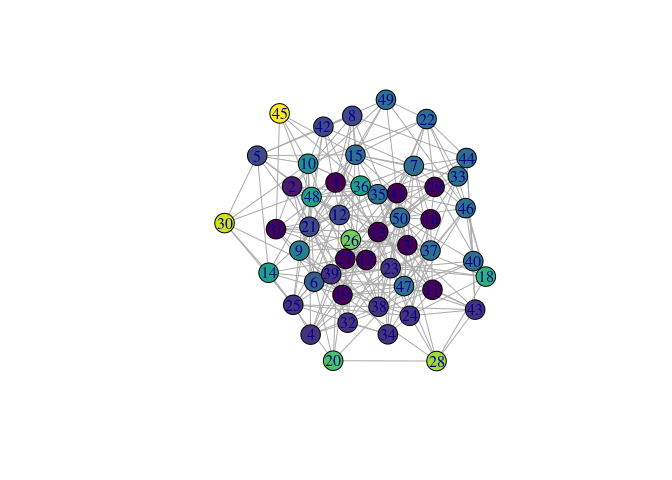

Make Reduced From Partition
================
Steven Wolf
12/8/2020

## Setup for the new function `make_reduced_from_partition`

Load all libraries and load the new function

``` r
library(concorR)
library(igraph)
```

    ## 
    ## Attaching package: 'igraph'

    ## The following objects are masked from 'package:stats':
    ## 
    ##     decompose, spectrum

    ## The following object is masked from 'package:base':
    ## 
    ##     union

``` r
library(viridis)
```

    ## Loading required package: viridisLite

``` r
source('mrfp.R')
```

## Proof of concept

I messed with `edge_betweenness` to find communities in the examples in
the standard README for `concorR`. They were not instructive (only one
community), so I abandoned that. Instead, I have created a random
network and found communities there:

``` r
set.seed(1234)
g  <-  erdos.renyi.game(50,p=0.2)
g_adj  <- as.matrix(as_adjacency_matrix(g))
ebc.g  <- edge.betweenness.community(g)
ebPart  <- list(ebc.g$membership)
```

Show the whole network:

``` r
vColor = viridis(max(unlist(ebPart)))
plot(g, vertex.color = vColor[ebc.g$membership])
```

<!-- -->

First, let’s show that the reduced network works for the degree
statistic:

``` r
g.red  <- make_reduced_from_partition(list(g_adj), ebPart, stat='degree')
plot_reduced(make_reduced_igraph(g.red$reduced_mat[[1]]))
```

<!-- -->

And now, the density statistic:

``` r
g.red.den  <- make_reduced_from_partition(list(g_adj), ebPart, stat='density')
plot_reduced(make_reduced_igraph(g.red.den$reduced_mat[[1]]))
```

<!-- -->

## Full function text

``` r
make_reduced_from_partition
```

    ## function (adj_list, partition_list, stat = "density") 
    ## {
    ##     if (stat == "density") {
    ##         dens_vec <- sapply(adj_list, function(x) .edge_dens(x))
    ##         mat_return <- vector("list", length = length(dens_vec))
    ##         for (i in 1:length(dens_vec)) {
    ##             this_adj_mat = adj_list[[i]]
    ##             thisBlk = partition_list[[i]]
    ##             nb = max(thisBlk)
    ##             reduced_den = matrix(0, nrow = nb, ncol = nb)
    ##             rownames(reduced_den) = paste("Block", 1:nb)
    ##             colnames(reduced_den) = paste("Block", 1:nb)
    ##             for (j in 1:nb) {
    ##                 nRows = sum(j == thisBlk)
    ##                 for (k in 1:nb) {
    ##                   nCols = sum(k == thisBlk)
    ##                   if (nRows == 1) {
    ##                     if (nCols == 1) {
    ##                       blk_adj_mat = this_adj_mat[j == thisBlk, 
    ##                         k == thisBlk]
    ##                       d = ifelse(blk_adj_mat > 0, 1, 0)
    ##                     }
    ##                     else {
    ##                       blk_adj_mat = this_adj_mat[j == thisBlk, 
    ##                         k == thisBlk]
    ##                       blk_adj_mat = matrix(blk_adj_mat, nrow = 1)
    ##                       d = .block_edge_dens(blk_adj_mat)
    ##                     }
    ##                   }
    ##                   else {
    ##                     if (nCols == 1) {
    ##                       blk_adj_mat = this_adj_mat[j == thisBlk, 
    ##                         k == thisBlk]
    ##                       blk_adj_mat = matrix(blk_adj_mat, ncol = 1)
    ##                     }
    ##                     else {
    ##                       blk_adj_mat = this_adj_mat[j == thisBlk, 
    ##                         k == thisBlk]
    ##                     }
    ##                     d = ifelse(i == j, .edge_dens(blk_adj_mat), 
    ##                       .block_edge_dens(blk_adj_mat))
    ##                   }
    ##                   reduced_den[j, k] = d
    ##                 }
    ##             }
    ##             temp1 <- reduced_den
    ##             temp1[is.nan(temp1)] <- 0
    ##             temp1[temp1 < dens_vec[[i]]] <- 0
    ##             temp1[temp1 > 0] <- 1
    ##             mat_return[[i]] <- temp1
    ##         }
    ##         return_list <- list()
    ##         return_list$reduced_mat <- mat_return
    ##         return_list$dens <- dens_vec
    ##         return(return_list)
    ##     }
    ##     else if (stat == "degree") {
    ##         outdegree = lapply(adj_list, function(x) .scaledDegree(x))
    ##         mat_return <- vector("list", length = length(outdegree))
    ##         for (i in 1:length(outdegree)) {
    ##             this_adj_mat = adj_list[[i]]
    ##             thisBlk = partition_list[[i]]
    ##             nb = max(thisBlk)
    ##             reduced_degree = matrix(0, nrow = nb, ncol = nb)
    ##             rownames(reduced_degree) = paste("Block", 1:nb)
    ##             colnames(reduced_degree) = paste("Block", 1:nb)
    ##             for (j in 1:nb) {
    ##                 nRows = sum(j == thisBlk)
    ##                 for (k in 1:nb) {
    ##                   nCols = sum(k == thisBlk)
    ##                   if (nRows == 1) {
    ##                     if (nCols == 1) {
    ##                       blk_adj_mat = this_adj_mat[j == thisBlk, 
    ##                         k == thisBlk]
    ##                       outDeg = ifelse(blk_adj_mat > 0, 1, 0)
    ##                     }
    ##                     else {
    ##                       blk_adj_mat = this_adj_mat[j == thisBlk, 
    ##                         k == thisBlk]
    ##                       blk_adj_mat = matrix(blk_adj_mat, nrow = 1)
    ##                       outDeg = .scaledDegree(blk_adj_mat)
    ##                     }
    ##                   }
    ##                   else {
    ##                     if (nCols == 1) {
    ##                       blk_adj_mat = this_adj_mat[j == thisBlk, 
    ##                         k == thisBlk]
    ##                       blk_adj_mat = matrix(blk_adj_mat, ncol = 1)
    ##                     }
    ##                     else {
    ##                       blk_adj_mat = this_adj_mat[j == thisBlk, 
    ##                         k == thisBlk]
    ##                     }
    ##                     outDeg = .scaledDegree(blk_adj_mat)
    ##                   }
    ##                   reduced_degree[j, k] = outDeg
    ##                 }
    ##             }
    ##             temp1 <- reduced_degree
    ##             temp1[is.nan(temp1)] <- 0
    ##             temp1[temp1 < outdegree[[i]]] <- 0
    ##             temp1[temp1 > 0] <- 1
    ##             mat_return[[i]] <- temp1
    ##         }
    ##         return_list <- list()
    ##         return_list$reduced_mat <- mat_return
    ##         return_list$deg <- outdegree
    ##         return(return_list)
    ##     }
    ##     else {
    ##         stop("Statistics implemented for determining edges in reduced networks are only \n         density and degree.")
    ##     }
    ## }
    ## <bytecode: 0x564cbd51ff88>
